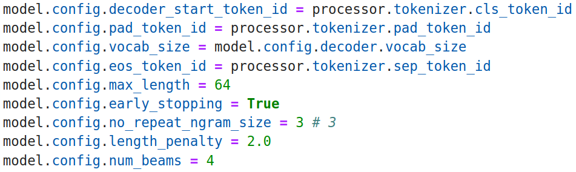
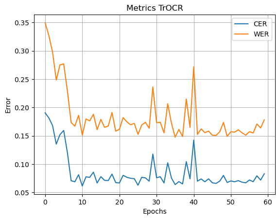
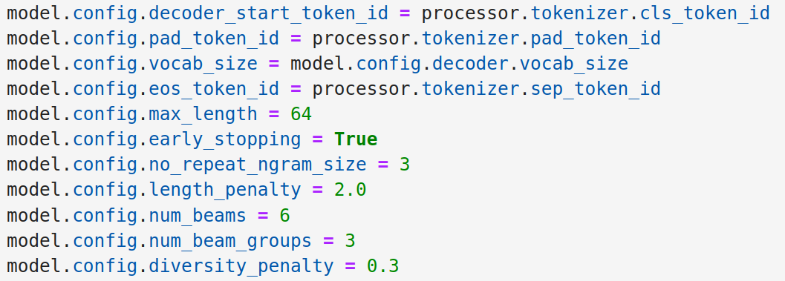
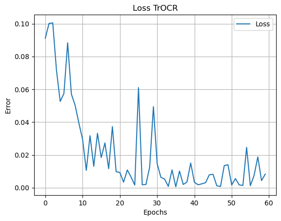
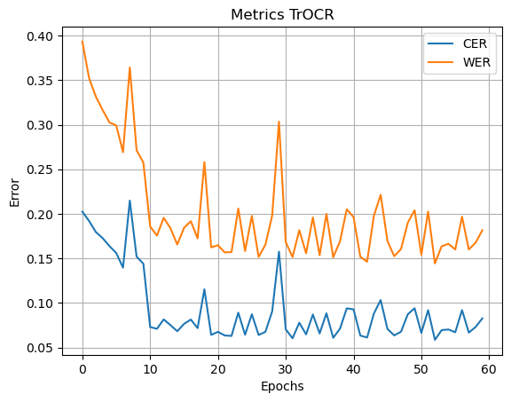

# Transformer-for-French-HTR
Fine-Tuning a Transformer Model for Handwritten French Text Recognition

## Description
This project focuses on fine-tuning the pre-trained transformer model ```microsoft/trocr-small-handwritten``` for the task of recognizing handwritten text in French. We utilize the RIMES 2011 dataset, which contains a diverse range of handwritten text samples, allowing us to improve recognition quality and adapt the model to the specifics of French handwriting.

### How to use
Clone this repo and run the notebook, dataset and required params would be settled.
### Main goals
- Model Adaptation: Fine-tune the pre-trained model ```microsoft/trocr-small-handwritten``` to enhance the accuracy of handwritten French text recognition.
- Performance Evaluation: Conduct an evaluation of the model's performance on the test set from RIMES 2011 dataset and compare the results with existing solutions.

### Dataset
The project uses the [RIMES 2011 dataset](https://storage.teklia.com/public/rimes2011/RIMES-2011-Lines.zip), which consists of:

- Handwritten texts in French, both word and line levels.
- Annotations that allow for mapping images to corresponding texts.

This dataset has a default split for train, test and validation sets, therefore these sets are used to have a comprehensive and valid comparison with existing results.
### Metrics
Classic metrics [WER](https://en.wikipedia.org/wiki/Word_error_rate) and [CER](https://huggingface.co/spaces/evaluate-metric/cer) were used not only because they provide deep analyze of the results, but also because they are commonly used by authors for both printed and handwritten text recognition. 

### Technologies Used

- Python: The primary programming language for implementing the project.
- Transformers: Pretrained transformer model from Hugging Face was used.
- PyTorch: A machine learning framework used for training the model.
- Metrics: A library [evaluate](https://github.com/huggingface/evaluate) from Hugging Face to calculate WER and CER.

## Results
### Example 1


Let's look at the chosen hyperparameters. In this strategy, an early stopping criterion for the beam search algorithm is applied. The transformer architecture includes special tokens: one for padding and another for indicating the absence of a label. The vocabulary size is also set for the model to function correctly. The maximum length of output tokens is taken as 64 — empirical results show that this is the optimal maximum value compared to the default of 20. In this experiment, early stopping is employed, meaning that as soon as the desired candidate is found, the process stops. Here, 3 beams are used, and there is no division into groups.


The result of the loss function when learning on 60 epochs without adding noise on data with an accumulating step of 4 and a batch size of 4 with selected hyperparameters. As can be seen from the graph above, the values of the loss function, although they can be abrupt, especially in the region of 30 epochs, generally tend to zero. The bursts at epochs 10 and 30 are due to the fact that the model, finding a local minimum, tries to get out of it. A similar situation can be observed in other experiments with different sets of parameters.



The results of metrics when training on 60 epochs without adding noise on data with an accumulating step of 4 and a batch size of 4 with selected hyperparameters.
### Example 2


Now let's look at another set of hyperparameters. The vocabulary size is also set for the model to function correctly. The maximum length of output tokens is taken as 64. In this experiment, early stopping is also applied, meaning that as soon as the desired candidate is found, the process stops. Here, 6 beams and 3 groups are used, and it is noted that in general, when setting such parameters, the number of beams should be a multiple of the number of groups. A *diversity_penalty* is also set, which is intended to assign a penalty if the same tokens are generated in different groups.



Here, the loss function also attempted to find another minimum at various epoches.



## Conclusion
After a series of experiments, the best results are WER = 14.4\% and CER = 5.8\% after ~8 hours of training, using hyperparameters from **example 2**. Comparable results with WER =  14.9% and CER = 6.7% were obtained after only ~6 hours of training with hyperparameters from example 1. Other sets of hyperparameters showed poor results compared to the experiments, mentioned above, and to the results of other authors on the chosen dataset.
